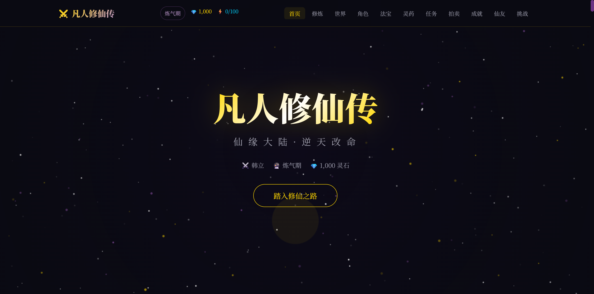

<<<<<<< HEAD
# 凡人修仙传 - 仙缘大陆 网页拓展需求文档（拓展版 v2.0）

> 基于 v1.1 版本进行深度拓展
>
> 文档版本: 2.0
> 拓展时间: 2026-03-21
> 拓展内容: 新增门派体系、突破系统、法宝炼制、羁绊系统、社交系统、拍卖行、成就系统、故事线详细规划、角色关系网、技术数据结构、交互微动效

---

## 一、世界观拓展

### 1.1 仙缘大陆背景

| 要素 | 内容 |
|------|------|
| **世界名称** | 仙缘大陆 / 灵界 / 灵界 |
| **核心法则** | 灵气复苏、修仙问道、逆天改命 |
| **修仙起源** | 上古仙人遗留功法，后经无数修士完善 |
| **资源体系** | 灵石、灵草、妖丹、炼器材料 |

### 1.2 地域设定

#### 🗺️ 仙缘大陆全域图

```
┌─────────────────────────────────────────────────────────────────┐
│                        乱星海                                   │
│            (韩立最初穿越至此，踏入修仙起点)                      │
├─────────────────────────────────────────────────────────────────┤
│  天南地区  │  燕家堡  │  血色禁地  │  虚天殿                   │
│  ─────────┼──────────┼────────────┼───────────                │
│  落云宗    │  幕兰草原│  鬼雾海域  │  昆吾山                   │
└─────────────────────────────────────────────────────────────────┘
```

#### 🌸 天南地区（重点详述）

天南地区是人界修仙界最为繁荣的核心区域，也是韩立修仙之路的起点与主要历练之地。

```
┌─────────────────────────────────────────────────────────────────┐
│                         天南地区                                 │
├─────────────────────────────────────────────────────────────────┤
│                                                                  │
│   ┌─────────┐    ┌─────────┐    ┌─────────┐    ┌─────────┐    │
│   │ 越京    │───→│ 燕家堡  │───→│ 血色禁地│───→│ 虚天殿  │    │
│   │ 墨府    │    │         │    │         │    │         │    │
│   └─────────┘    └─────────┘    └─────────┘    └─────────┘    │
│       │                                                      │    │
│       ▼                                                      ▼    │
│   ┌─────────┐                                        ┌─────────┐│
│   │ 掩月宗  │                                        │ 魁星岛  ││
│   │ 南宫婉  │                                        │         ││
│   └─────────┘                                        └─────────┘│
│                                                                  │
└─────────────────────────────────────────────────────────────────┘
```

##### 1. 越京（故事起点）

| 要素 | 详情 |
|------|------|
| **地位** | 天南地区东部凡人城市 |
| **标志性事件** | 韩立被墨大夫带入府邸，传授长春功 |
| **建筑** | 越京墨府（后被韩立所灭） |
| **灵根属性** | 变异的木属性天灵根（韩立） |

##### 2. 燕家堡

| 要素 | 详情 |
|------|------|
| **地位** | 天南修仙世家 |
| **标志性事件** | 韩立参加夺宝大会，获得金刚罩 |
| **重要人物** | 燕家堡少主 |
| **特产** | 燕家血脉神通 |

##### 3. 血色禁地

| 要素 | 详情 |
|------|------|
| **地位** | 天南与慕兰交界处的大型禁地 |
| **危险性** | 极高，仅限筑基期以下进入 |
| **标志性产出** | 大量灵药、筑基丹主材 |
| **重要事件** | 韩立在此获得掌天瓶（灵界篇揭示） |
| **禁地规则** | 十年一开，筑基以上修士无法进入 |

##### 4. 虚天殿

| 要素 | 详情 |
|------|------|
| **地位** | 乱星海最大修仙宗门遗址 |
| **标志性建筑** | 虚天鼎、乾蓝冰焰 |
| **宗门传承** | 逆星盟 |
| **关键人物** | 呼言老道、云露老魔 |
| **至宝** | 虚天鼎（韩立所得） |

##### 5. 落云宗

| 要素 | 详情 |
|------|------|
| **地位** | 天南大宗 |
| **宗门传承** | 以"云梦山"为根基 |
| **重要人物** | 程姓师伯、吕姓师伯 |
| **与韩立关系** | 韩立曾在此地修炼 |

##### 6. 掩月宗

| 要素 | 详情 |
|------|------|
| **地位** | 天南顶级宗门 |
| **标志性功法** | 素女轮回功 |
| **重要人物** | 南宫婉（弟子/长老） |
| **与韩立关系** | 韩立与南宫婉双修之地 |

#### 🌊 其他重要地域

| 地域 | 特点 | 标志性事件 |
|------|------|------------|
| **乱星海** | 妖兽资源丰富 | 韩立击杀妖蛇、取得补天丹 |
| **幕兰草原** | 游牧民族所在 | 韩立参加拍卖会 |
| **鬼雾海域** | 神秘危险海域 | 鬼雾出现，修士陨落 |
| **昆吾山** | 远古修仙遗址 | 群修争夺古宝 |
| **魁星岛** | 乱星海交易枢纽 | 韩立进行交易 |

### 1.3 修仙门派体系（新增）

| 门派 | 定位 | 镇派功法 | 门派特色 | 与韩立关系 |
|------|------|----------|----------|------------|
| **黄枫谷** | 天南大宗 | 青元剑诀 | 剑修圣地，韩立入门之宗 | 韩立出身宗门 |
| **掩月宗** | 天南顶级 | 素女轮回功 | 以女修为主，媚术精绝 | 南宫婉所在宗门 |
| **落云宗** | 天南大宗 | 落云心法 | 云系功法，仙气缥缈 | 韩立修炼之地 |
| **逆星盟** | 乱星海势力 | 各流派兼修 | 散修联合，资源争夺 | 虚天殿关键势力 |
| **银月狼族** | 妖族势力 | 妖族传承 | 银月血脉，妖修之路 | 银月出身家族 |
| **夜叉族** | 外族势力 | 夜叉神通 | 灵界异族，敌对势力 | 与韩立长期对立 |

### 1.4 天地异象与副本场景（新增）

| 场景名称 | 危险等级 | 进入条件 | 核心产出 | 场景特色 |
|----------|----------|----------|----------|----------|
| **血色禁地** | ★★★★★ | 筑基以下 | 灵药、筑基丹材料 | 十年一开，暗藏掌天瓶 |
| **虚天殿** | ★★★★☆ | 金丹以上 | 虚天鼎、乾蓝冰焰 | 上古遗迹，内有妖修 |
| **昆吾山** | ★★★★★ | 元婴以上 | 远古法宝残片 | 群修夺宝，暗流涌动 |
| **鬼雾海域** | ★★★★★ | 金丹以上 | 鬼道传承 | 神秘莫测，吞噬一切 |
| **坠魔谷** | ★★★★☆ | 金丹以上 | 魔道功法 | 魔气森森，考验心性 |
| **天澜草原** | ★★★☆☆ | 筑基以上 | 草原灵药 | 游牧势力，拍卖之地 |
| **万妖谷** | ★★★★☆ | 金丹以上 | 妖丹、妖族秘宝 | 妖族聚居，凶险万分 |

---

## 二、修炼体系深度拓展

### 2.1 境界体系（九层境界）

| 境界 | 灵气形态 | 寿命 | 标志性特征 | 代表人物 |
|------|----------|------|------------|----------|
| **炼气期** | 吸纳灵气入体 | 150-200年 | 引气入体，锤炼肉身 | 初期韩立 |
| **筑基期** | 灵气化液 | 300-500年 | 丹田气海，结成灵基 | 韩立 |
| **金丹期** | 金色金丹 | 800-1000年 | 金丹大成，法力凝聚 | 韩立 |
| **元婴期** | 元婴出窍 | 2000-3000年 | 元婴初成，可夺舍 | 银月 |
| **化神期** | 神念化形 | 5000-8000年 | 神通初现，可沟通天地 | 银月 |
| **炼虚期** | 虚实转换 | 万年以上 | 身化万千，领悟法则 | 紫灵 |
| **合体期** | 身合大道 | 数万年 | 人法合一 | 各大宗主 |
| **大乘期** | 半仙之体 | 十万年 | 渡劫前置，可飞升 | 敖啸 |
| **渡劫期** | 飞升在即 | 随时天劫 | 承受天劫考验 | 待飞升者 |

### 2.2 特殊修炼体系

- **炼体**: 淬体炼骨，以身抗天
- **傀儡**: 机关术数，炼制甲士
- **阵法**: 布阵对敌，困敌杀敌
- **符箓**: 天地符纹，驱雷掣电
- **炼丹**: 灵药融合，突破境界

### 2.3 境界突破系统设计（新增）

```
┌──────────────────────────────────────────────────────────────┐
│                     境界突破流程                               │
├──────────────────────────────────────────────────────────────┤
│                                                               │
│   ┌─────────┐   ┌─────────┐   ┌─────────┐   ┌─────────┐    │
│   │ 灵气积累 │──→│ 境界瓶颈 │──→│ 突破渡劫 │──→│ 境界稳固 │    │
│   │ (修炼)   │   │ (触发)   │   │ (挑战)   │   │ (完成)   │    │
│   └─────────┘   └─────────┘   └─────────┘   └─────────┘    │
│                                                               │
│   突破材料: 灵药/丹药/悟道石/机缘                              │
│   突破风险: 瓶颈→渡劫失败→境界倒退/走火入魔                    │
│   突破奖励: 新技能解锁/属性飞跃/寿命延长                        │
└──────────────────────────────────────────────────────────────┘
```

### 2.4 功法属性体系（新增）

| 属性类别 | 包含元素 | 五行相克 | 修炼方向 |
|----------|----------|----------|----------|
| **金系** | 锐金、庚金 | 克木，被火克 | 攻击强化，飞剑伤害 |
| **木系** | 青木、灵木 | 克土，被金克 | 生命恢复，木系功法 |
| **水系** | 寒水、玄水 | 克火，被土克 | 辅助增益，冰系攻击 |
| **火系** | 离火、真火 | 克金，被水克 | 爆发输出，焚化技能 |
| **土系** | 厚土、戊土 | 克水，被木克 | 防御强化，土遁术 |

### 2.5 神通技能树（新增）

```
                    ┌─────────────┐
                    │  大乘神通   │
                    │  渡劫神通   │
                    └──────┬──────┘
                           │
          ┌────────────────┼────────────────┐
          │                │                │
   ┌──────▼──────┐ ┌──────▼──────┐ ┌──────▼──────┐
   │  攻击神通   │ │  防御神通   │ │  辅助神通   │
   │  青元剑诀   │ │  金刚不坏   │ │  隐匿遁术   │
   │  梵圣真魔功 │ │  护体灵光   │ │  缩地成寸   │
   │  大五行决   │ │  玄冰护盾   │ │  通灵之术   │
   └──────┬──────┘ └──────┬──────┘ └──────┬──────┘
          │                │                │
   ┌──────▼──────┐ ┌──────▼──────┐ ┌──────▼──────┐
   │  剑道传承   │ │  炼体之术   │ │  傀儡阵法   │
   │  飞剑斩杀   │ │  淬体锻骨   │ │  阵法困敌   │
   │  剑阵合击   │ │  肉身成圣   │ │  符箓驱雷   │
   └─────────────┘ └─────────────┘ └─────────────┘
```

---

## 三、核心角色详细设定

### 3.1 主要角色卡片

```
┌──────────────────────────────────────────────────────────────────┐
│                        韩立（主角）                               │
├──────────────────────────────────────────────────────────────────┤
│  境界: 渡劫期（大乘）                                             │
│  功法: 青元剑诀（大五行决）、梵圣真魔功                          │
│  法宝: 掌天瓶、青竹蜂云剑、虚天鼎                                 │
│  特点: 谨慎低调、谋定后动、修炼小绿瓶                             │
│  身份: 人界修士 → 灵界飞升 → 仙界                                 │
└──────────────────────────────────────────────────────────────────┘

┌──────────────────────────────────────────────────────────────────┐
│                      紫灵仙子                                     │
├──────────────────────────────────────────────────────────────────┤
│  境界: 炼虚期                                                    │
│  种族: 银月狼族（半妖）                                           │
│  特点: 绝美容颜、歌舞双绝、修炼天魔媚功                           │
│  与韩立: 红颜知己，共同经历诸多风雨                               │
└──────────────────────────────────────────────────────────────────┘

┌──────────────────────────────────────────────────────────────────┐
│                        银月                                       │
├──────────────────────────────────────────────────────────────────┤
│  境界: 化神期（曾为元婴）                                         │
│  种族: 银月狼族（妖修）                                           │
│  特点: 化身少女、记忆残缺、与韩立双修                            │
│  法宝: 银月弯刀                                                 │
└──────────────────────────────────────────────────────────────────┘

┌──────────────────────────────────────────────────────────────────┐
│                      南宫婉                                       │
├──────────────────────────────────────────────────────────────────┤
│  境界: 元婴期                                                    │
│  宗门: 掩月宗                                                    │
│  特点: 绝色美女、修炼素女轮回功、与韩立双修                       │
│  与韩立: 道侣关系，轮回殿主身份                                   │
└──────────────────────────────────────────────────────────────────┘
```

### 3.2 其他重要角色

| 角色 | 境界 | 身份 | 特点 |
|------|------|------|------|
| **墨大夫** | 金丹期 | 越京墨府 | 传授长春功，企图夺舍 |
| **向之礼** | 化神期 | 人界第一修士 | 化身万修，探寻飞升 |
| **呼言老道** | 元婴期 | 逆星盟 | 虚天殿相识 |
| **云露老魔** | 元婴期 | 逆星盟 | 好色之徒 |
| **敖啸** | 大乘期 | 银月狼族 | 银月祖父 |
| **夜叉族大乘** | 大乘期 | 夜叉族 | 对立势力 |

### 3.3 角色关系网（新增）

```
                         ┌───────────┐
                         │   韩  立   │
                         │  (主角)   │
                         └─────┬─────┘
              ┌────────────────┼────────────────┐
              │                │                │
       ┌──────▼──────┐ ┌──────▼──────┐ ┌──────▼──────┐
       │   南宫婉    │ │   紫灵仙子   │ │    银  月   │
       │  (道侣)     │ │  (红颜知己)  │ │  (灵宠伙伴)  │
       │  掩月宗     │ │  炼虚期      │ │  银月狼族    │
       └──────┬──────┘ └──────┬──────┘ └──────┬──────┘
              │                │                │
       ┌──────▼──────┐ ┌──────▼──────┐ ┌──────▼──────┐
       │   墨大夫    │ │   向之礼    │ │    敖  啸    │
       │  (引路人)   │ │  (人界最强)  │ │  (银月祖父)  │
       │  越京墨府   │ │  化神期      │ │  大乘期      │
       └─────────────┘ └─────────────┘ └─────────────┘
```

### 3.4 新增支线角色（新增）

| 角色 | 境界 | 身份 | 背景故事 | 关键剧情 |
|------|------|------|----------|----------|
| **厉飞雨** | 炼气期 | 韩立同门挚友 | 痴心修仙，以命换修 | 与韩立并肩入血色禁地 |
| **辛如音** | 筑基期 | 灵界女修 | 温婉灵秀，倾心韩立 | 灵界篇中陪伴韩立历练 |
| **银月（幼年）** | 妖修 | 银月狼族公主 | 记忆残缺，被封印 | 化形之秘，暗藏大能 |
| **董萱儿** | 金丹期 | 掩月宗长老 | 南宫婉同门，护道心切 | 阻止韩立与南宫婉来往 |
| **呼言老道** | 元婴期 | 逆星盟高层 | 虚天殿相识，亦敌亦友 | 虚天殿夺宝关键人物 |

---

## 四、法宝详细设定

### 4.1 至宝系列

| 法宝 | 等级 | 所有者 | 功效描述 |
|------|------|--------|----------|
| **掌天瓶** | 先天至宝 | 韩立 | 时间法则至宝，可催熟灵药，逆转时间 |
| **玄天斩灵剑** | 玄天之宝 | 韩立 | 斩灵灭仙，混沌二宝之一 |
| **虚天鼎** | 灵宝 | 韩立 | 虚天殿至宝，内有乾蓝冰焰 |
| **青竹蜂云剑** | 飞剑 | 韩立 | 108口飞剑，配套剑阵 |

### 4.2 其他知名法宝

```
青元剑        - 韩立早期所用
混元尺        - 攻防一体
五龙铡        - 困敌法宝
万古不变        - 时间法则
黑风旗        - 空间传送
火须子        - 火焰精灵
金刚罩        - 防御护体
```

### 4.3 灵药仙草

| 灵药 | 功效 | 所在 |
|------|------|------|
| **霓裳草** | 吸引妖兽 | 乱星海 |
| **银角芝** | 炼制筑基丹 | 各宗门 |
| **龙鳞果** | 突破境界 | 昆吾山 |
| **补天丹** | 改善资质 | 虚天殿 |
| **万年玄冰** | 冰封保存 | 极北之地 |

### 4.4 法宝炼制与升级系统（新增）

```
┌──────────────────────────────────────────────────────────────┐
│                     法宝炼制流程                               │
├──────────────────────────────────────────────────────────────┤
│                                                               │
│   ┌─────────┐   ┌─────────┐   ┌─────────┐   ┌─────────┐    │
│   │ 材料收集 │──→│ 炼器炉台 │──→│ 器灵注入 │──→│ 法宝成型 │    │
│   │ 灵材/矿石│   │ 真火锻造 │   │ 精血/神魂│   │ 法宝品级 │    │
│   └─────────┘   └─────────┘   └─────────┘   └─────────┘    │
│                                                               │
│   材料来源: 妖丹/矿脉/秘境采集/击杀BOSS                        │
│   炼器等级: 法器→法宝→灵宝→玄天之宝→先天至宝                  │
│   炼器技能: 需修炼"炼器"副业，等级越高品质越好                  │
└──────────────────────────────────────────────────────────────┘
```

### 4.5 法宝属性面板（UI设计参考，新增）

```
┌──────────────────────────────────────────────────────────────┐
│  ⚔️  掌天瓶                                                    │
│  ━━━━━━━━━━━━━━━━━━━━━━━━━━━━━━━━━━━━━━━━━━━━━━━━━━━━━━━━━━  │
│  等级: 先天至宝 ─────────────────────────────────── [★★★★★]  │
│  属性: 时间法则                                               │
│  主人: 韩立                                                   │
│  ━━━━━━━━━━━━━━━━━━━━━━━━━━━━━━━━━━━━━━━━━━━━━━━━━━━━━━━━━━  │
│  基础属性                                                     │
│  ├─ 攻击力: +∞（无直接攻击）                                  │
│  ├─ 辅助效果: 催熟灵药（时间加速×1000）                        │
│  ├─ 特殊技能: 逆转时间、还原灵药年份                           │
│  └─ 耐久度: ∞（先天至宝，永不磨损）                            │
│  ━━━━━━━━━━━━━━━━━━━━━━━━━━━━━━━━━━━━━━━━━━━━━━━━━━━━━━━━━━  │
│  背景故事:                                                     │
│  掌天瓶，又名"小绿瓶"，先天至宝，                              │
│  蕴含时间法则之力，能催熟一切灵药仙草。                        │
│  韩立凭借此宝在修仙路上步步为营，逆天改命。                    │
└──────────────────────────────────────────────────────────────┘
```

### 4.6 法宝羁绊系统（新增）

| 羁绊组合 | 激活条件 | 羁绊效果 | 适用法宝 |
|----------|----------|----------|----------|
| **青元剑阵** | 集齐108口青竹蜂云剑 | 剑阵攻击力+300% | 青竹蜂云剑 |
| **虚天三宝** | 虚天鼎 + 乾蓝冰焰 | 防御力+200%、冰系攻击强化 | 虚天鼎 |
| **先天双生** | 掌天瓶 + 玄天斩灵剑 | 混沌法则觉醒，全属性+100% | 掌天瓶、玄天斩灵剑 |
| **轮回之恋** | 韩立 + 南宫婉均佩戴同心法宝 | 双修效率+50%、羁绊技能解锁 | 同心玉佩 |

---

## 五、页面交互设计拓展

### 5.1 动画效果详情

| 页面区块 | 动画效果 | 实现方式 |
|----------|----------|----------|
| **Hero背景** | 云雾流动 + 星辰闪烁 + 太极粒子 | Canvas粒子系统 |
| **标题入场** | 淡入 + 上浮 + 金光闪烁 | CSS Keyframes |
| **境界卡片** | 悬停发光 + 境界之气环绕 | CSS Hover + JS |
| **角色展示** | 轮播切换 + 仙气飘飘 | CSS Transform |
| **法宝展示** | 3D旋转 + 灵光环绕 | CSS 3D Transform |

### 5.2 音效设计（可选）

- 背景音乐: 古筝/笛子仙侠风格BGM
- 交互音效: 点击/悬停音效
- 页面转换: 仙风道骨音效

### 5.3 响应式断点

```
移动端: < 768px    (单列布局，卡片堆叠)
平板端: 768-1024px (双列布局)
桌面端: > 1024px   (多列布局，全效果展示)
```

### 5.4 界面UI组件规范（新增）

#### 5.4.1 境界排行榜组件

```
┌──────────────────────────────────────────────────────────────┐
│  🏆 仙缘大陆 - 修仙境界排行榜                                 │
│  ━━━━━━━━━━━━━━━━━━━━━━━━━━━━━━━━━━━━━━━━━━━━━━━━━━━━━━━━━━  │
│                                                               │
│  #1  向之礼      │ 化神期 │██████████████████████████████████│ 99%  │
│  #2  韩  立      │ 金丹期 │██████████████████████████████    │ 85%  │
│  #3  南宫婉      │ 元婴期 │██████████████████████████████    │ 80%  │
│  #4  墨大夫      │ 金丹期 │██████████████████                │ 55%  │
│  #5  呼言老道    │ 元婴期 │██████████████████                │ 50%  │
│                                                               │
│  [查看全部排行] [按境界筛选] [按地区筛选]                      │
└──────────────────────────────────────────────────────────────┘
```

#### 5.4.2 灵药图鉴组件

```
┌──────────────────────────────────────────────────────────────┐
│  🌿 灵药仙草图鉴                                              │
│  ━━━━━━━━━━━━━━━━━━━━━━━━━━━━━━━━━━━━━━━━━━━━━━━━━━━━━━━━━━  │
│                                                               │
│  ┌─────────┐ ┌─────────┐ ┌─────────┐ ┌─────────┐            │
│  │ 霓裳草  │ │ 银角芝  │ │ 龙鳞果  │ │ 补天丹  │            │
│  │ ☆☆☆☆☆  │ │ ☆☆☆☆   │ │ ☆☆☆☆☆  │ │ ☆☆☆☆☆  │            │
│  │ 吸引妖兽│ │ 筑基丹材│ │ 突破境界│ │ 改善资质│            │
│  └─────────┘ └─────────┘ └─────────┘ └─────────┘            │
│                                                               │
│  ┌─────────┐ ┌─────────┐ ┌─────────┐ ┌─────────┐            │
│  │ 万年玄冰│ │ 九曲灵参│ │ 玉髓芝  │ │ 紫韵花  │            │
│  │ ☆☆☆☆   │ │ ☆☆☆☆☆  │ │ ☆☆☆    │ │ ☆☆☆☆   │            │
│  │ 冰封保存│ │ 炼丹圣药│ │ 常见灵草│ │ 阵法材料│            │
│  └─────────┘ └─────────┘ └─────────┘ └─────────┘            │
│                                                               │
│  [按稀有度筛选] [按功效筛选] [搜索灵药]                       │
└──────────────────────────────────────────────────────────────┘
```

### 5.5 页面动效扩展细节（新增）

| 动效名称 | 触发条件 | 视觉表现 | 技术方案 |
|----------|----------|----------|----------|
| **灵气入体** | 境界提升时 | 金色光点从四周汇入角色身体 | Canvas粒子动画 |
| **飞剑出鞘** | 点击剑系法宝 | 剑光闪烁，剑影从屏幕外飞入 | CSS 3D + Keyframes |
| **星辰坠落** | Hero区域背景循环 | 流星划过天际，渐隐渐显 | Canvas绘制 |
| **仙气飘散** | 角色卡片悬停 | 半透明白色气流从卡片边缘散出 | CSS伪元素 + 动画 |
| **太极轮转** | 页面加载完成 | 太极八卦图缓慢旋转并缩放 | CSS Transform + 动画 |
| **灵草生长** | 灵药图鉴卡片展开 | 从种子到灵草的生长过程 | CSS Morphing动画 |
| **阵法显现** | 副本区域进入 | 六芒星阵法从地面升起 | SVG + CSS动画 |

### 5.6 交互微动效（新增）

| 交互 | 效果 | 目的 |
|------|------|------|
| 按钮悬停 | 金光微闪 + 略微放大(1.05) | 提示可点击 |
| 境界卡片点击 | 境界之气从底部升起 | 反馈操作 |
| 角色切换 | 仙气飘飘的过渡动画 | 增强沉浸感 |
| 法宝3D旋转 | 拖拽旋转 + 灵光环绕 | 探索细节 |
| 长按灵药 | 放大查看 + 属性浮窗 | 深度了解 |

---

## 六、内容页拓展

### 6.1 故事线展示

```
第一卷: 山村少年
    ↓
第二卷: 初踏修仙
    ↓
第三卷: 纵横人界
    ↓
第四卷: 灵界之篇
    ↓
第五卷: 仙界篇（进行中）
```

### 6.2 详细卷章规划（新增）

| 卷章 | 名称 | 核心剧情 | 修仙里程碑 | 难度 |
|------|------|----------|------------|------|
| **第一卷** | 山村少年 | 韩立被墨大夫收徒，修炼长春功 | 凡人→炼气期 | ★☆☆☆☆ |
| **第二卷** | 黄枫谷 | 入门黄枫谷，结识厉飞雨 | 炼气期→筑基期 | ★★☆☆☆ |
| **第三卷** | 血色禁地 | 十年一开的禁地冒险 | 筑基期，获掌天瓶 | ★★★☆☆ |
| **第四卷** | 天南风云 | 越京风云，燕家堡夺宝 | 筑基期→金丹期 | ★★★☆☆ |
| **第五卷** | 乱星海 | 乱星海崛起，击杀妖兽 | 金丹期→元婴期 | ★★★★☆ |
| **第六卷** | 虚天殿 | 虚天殿夺宝，获得虚天鼎 | 元婴期，获至宝 | ★★★★☆ |
| **第七卷** | 昆吾山 | 远古遗迹群修夺宝 | 元婴期→化神期 | ★★★★★ |
| **第八卷** | 飞升灵界 | 踏入灵界，新世界探索 | 化神期→炼虚期 | ★★★★★ |
| **第九卷** | 灵界终章 | 人族存亡之战 | 炼虚期→合体期 | ★★★★★ |
| **第十卷** | 仙界篇 | 飞升仙界，大道无尽 | 大乘期→渡劫期 | ★★★★★ |

### 6.3 经典语录（扩展）

> "修仙修仙，若是没了那颗向道之心，即使修为再高，也不过是一具行尸走肉。"
> — 韩立

> "修仙界弱肉强食，只有活着，才是最大的道理。"
> — 墨大夫

> "天道酬勤，但更要天命所归。掌天瓶在手，我不信命。"
> — 韩立（灵界篇）

> "飞升之路，万中无一。向某不才，愿为天下修士试一试。"
> — 向之礼

> "轮回尽头，你我终会相见。"
> — 南宫婉

---

## 七、社交与互动系统（新增）

### 7.1 仙友系统

| 功能 | 说明 | 交互设计 |
|------|------|----------|
| **仙友列表** | 添加、查看修仙道友 | 双列布局，左侧列表右侧详情 |
| **传音入密** | 仙友间实时聊天 | 聊天气泡 + 仙侠表情 |
| **仙缘值** | 好感度系统，影响双修效率 | 桃花花瓣计量条 |
| **组队副本** | 多人探索血色禁地等 | 4人小队匹配界面 |

### 7.2 聊天系统UI（新增）

```
┌──────────────────────────────────────────────────────────────┐
│  💬 仙友传音                                     [设置] [✕]  │
│  ━━━━━━━━━━━━━━━━━━━━━━━━━━━━━━━━━━━━━━━━━━━━━━━━━━━━━━━━━━  │
│                                                               │
│  [南宫婉]  ┌──────────────────────────────┐                   │
│            │ 韩兄，虚天殿即将开启，       │                   │
│            │ 你可要同行？                  │                   │
│            └──────────────────────────────┘                   │
│                                                               │
│                      ┌──────────────────────────────┐ [韩立] │
│                      │ 虚天殿危机四伏，         │         │
│                      │ 南宫姑娘还需多加小心。     │         │
│                      └──────────────────────────────┘        │
│                                                               │
│  ━━━━━━━━━━━━━━━━━━━━━━━━━━━━━━━━━━━━━━━━━━━━━━━━━━━━━━━━━━  │
│  [输入传音内容...]                              [发送] [📎]   │
└──────────────────────────────────────────────────────────────┘
```

---

## 八、商城与交易系统（新增）

### 8.1 拍卖行系统

| 功能 | 说明 |
|------|------|
| **寄售灵物** | 上架法宝、灵药、材料，设定起拍价与一口价 |
| **竞价拍卖** | 实时出价，最后30秒加价延时 |
| **灵石货币** | 游戏内通用货币，通过任务/副本获取 |
| **商城直购** | 限定外观、坐骑、特殊道具 |

### 8.2 交易流程

```
┌──────────────────────────────────────────────────────────────┐
│  💰 仙缘拍卖行                                                │
│  ━━━━━━━━━━━━━━━━━━━━━━━━━━━━━━━━━━━━━━━━━━━━━━━━━━━━━━━━━━  │
│                                                               │
│  [灵药] [法宝] [材料] [功法] [坐骑] [搜索]                    │
│  ───────────────────────────────────────────────────────────  │
│                                                               │
│  物品名称          当前价      剩余时间     竞拍次数           │
│  ───────────────────────────────────────────────────────────  │
│  银角芝 ×3         500灵石     2:15:30     12次竞拍           │
│  青竹蜂云剑(残)    8,000灵石   0:05:12     45次竞拍 ⚡       │
│  筑基丹配方        2,500灵石   5:42:00     8次竞拍            │
│  九曲灵参(百年)    12,000灵石  1:20:00     23次竞拍           │
│                                                               │
│  [我的寄售] [竞拍记录] [灵石余额: 25,000]                    │
└──────────────────────────────────────────────────────────────┘
```

---

## 九、成就系统（新增）

### 9.1 修仙成就类别

| 成就类别 | 示例成就 | 奖励 |
|----------|----------|------|
| **境界之路** | 突破金丹期 / 突破元婴期 | 称号 + 灵石 |
| **法宝收集** | 集齐10件法宝 / 获得先天至宝 | 专属光环 |
| **灵药图鉴** | 鉴定100种灵药 / 集齐全部灵药 | 炼丹经验加成 |
| **副本征服** | 通关血色禁地 / 虚天殿全BOSS | 稀有材料箱 |
| **仙缘社交** | 结交50位仙友 / 结为道侣 | 羁绊技能 |
| **传奇故事** | 完成全部十卷剧情 | 称号"大道无尽" |

### 9.2 称号系统

| 称号 | 获取条件 | 属性加成 |
|------|----------|----------|
| **山村少年** | 完成第一卷剧情 | 全属性+5% |
| **黄枫谷弟子** | 入门黄枫谷 | 剑系伤害+10% |
| **血色猎人** | 首通血色禁地 | 灵药收获+20% |
| **虚天之主** | 获得虚天鼎 | 冰系防御+30% |
| **飞升者** | 成功飞升灵界 | 全属性+25% |
| **大道无尽** | 完成全部十卷 | 全属性+50%，特效光环 |

---

## 十、技术实现补充

### 10.1 资源加载策略

```javascript
// 字体加载
- 预加载关键字体
- 使用 font-display: swap

// 图片优化
- 使用 WebP 格式
- 懒加载非首屏图片

// 动画优化
- 使用 transform + opacity
- 避免重排重绘
```

### 10.2 数据结构参考（新增）

```javascript
// 境界数据模型
const RealmData = {
  name: "金丹期",
  level: 3,
  maxLevel: 9,
  lifespan: 800,        // 年
  breakthrough: {
    materials: ["灵药×3", "悟道石×1"],
    difficulty: 0.35,    // 成功率
    consequences: "走火入魔" // 失败后果
  }
};

// 法宝数据模型
const TreasureData = {
  name: "掌天瓶",
  grade: "先天至宝",
  owner: "韩立",
  attributes: {
    attack: null,
    defense: null,
    special: "时间法则: 催熟灵药",
    durability: Infinity
  },
  bonds: ["先天双生"],  // 羁绊组合
  lore: "小绿瓶，蕴含时间法则之力..."
};

// 角色数据模型
const CharacterData = {
  name: "韩立",
  realm: "渡劫期",
  skills: ["青元剑诀", "梵圣真魔功", "大五行决"],
  treasures: ["掌天瓶", "青竹蜂云剑", "虚天鼎"],
  relationships: [
    { name: "南宫婉", type: "道侣", affinity: 100 },
    { name: "紫灵仙子", type: "红颜知己", affinity: 85 },
    { name: "银月", type: "灵宠伙伴", affinity: 95 }
  ]
};
```

### 10.3 性能目标

| 指标 | 目标值 |
|------|--------|
| 首屏加载 | < 3s |
| FCP | < 1.5s |
| LCP | < 2.5s |
| 帧率 | 60fps |

### 10.4 性能优化扩展（新增）

| 优化项 | 方案 | 预期收益 |
|--------|------|----------|
| Canvas粒子 | 对象池复用 + 离屏渲染 | 帧率稳定60fps |
| 图片加载 | WebP + 渐进式 + 占位模糊 | 首屏<2s |
| 字体加载 | 预加载 + font-display:swap + 子集化 | 无文字闪烁 |
| 组件懒加载 | Intersection Observer | 首屏体积减少40% |
| 动画降级 | prefers-reduced-motion检测 | 无障碍友好 |
| 缓存策略 | Service Worker + 版本号缓存 | 二次访问<1s |

---

## 十一、验收标准（v2.0）

- [ ] 九大境界卡片完整展示，每张卡片有独特视觉效果和突破流程说明
- [ ] 十卷故事线可视化展示，支持交互式剧情浏览
- [ ] 四位核心角色 + 五位支线角色信息完整呈现，含关系网可视化
- [ ] 法宝炼制/升级流程展示，羁绊系统完整
- [ ] 灵药图鉴8种灵药可视化，支持筛选和搜索
- [ ] 境界排行榜组件可交互，支持筛选
- [ ] 拍卖行交易流程完整展示
- [ ] 成就系统和称号系统展示
- [ ] 仙友聊天系统UI原型
- [ ] 7种页面动效全部实现，无卡顿
- [ ] 交互微动效覆盖所有可交互元素
- [ ] 三种响应式断点正常显示
- [ ] 深色背景 + 紫金绿配色统一
- [ ] 书法标题 + 衬线正文正确加载
- [ ] 首屏FCP < 1.5s，LCP < 2.5s
- [ ] 移动端全功能可用
- [ ] 无控制台报错

---

**拓展板块总结（v1.1 → v2.0 新增10大板块）：**

1. **修仙门派体系** — 6大门派详细设定
2. **天地异象副本** — 7个副本场景设计
3. **境界突破系统** — 完整的突破流程和属性设计
4. **功法属性体系** — 五行相克 + 神通技能树
5. **法宝炼制与羁绊** — 炼制流程 + 4组羁绊组合
6. **角色关系网** — 核心+支线共9位角色关系可视化
7. **十卷故事线** — 从山村少年到仙界篇的完整剧情规划
8. **社交与聊天系统** — 仙友、传音、组队副本
9. **拍卖行与交易系统** — 完整的经济系统设计
10. **成就与称号系统** — 6类成就 + 6级称号体系

---

*文档版本: 2.0*
*拓展时间: 2026-03-21*
*更新内容: 新增门派体系、突破系统、法宝炼制、羁绊系统、社交系统、拍卖行、成就系统、故事线详细规划、角色关系网、技术数据结构、交互微动效*
=======
<div align="center">

# &#x2728; 凡人修仙传 - 仙缘大陆 &#x2728;

**一个以《凡人修仙传》为主题的沉浸式修仙 Web 应用**

[](https://react.dev/)
[](https://www.typescriptlang.org/)
[](https://vite.dev/)
[](https://zustand-demo.pmnd.rs/)
[](https://app-rho-five-25.vercel.app)

[在线体验](https://app-rho-five-25.vercel.app) | [功能一览](#-功能系统) | [快速开始](#-快速开始) | [项目结构](#-项目结构)



</div>

---

## 简介

**仙缘大陆** 是一个以忘语经典小说《凡人修仙传》为世界观背景打造的 Web 互动体验平台。玩家可以在浏览器中体验完整的修仙旅程 —— 从凡人练气到飞升仙界，修炼功法、收集法宝、采集灵药、完成任务、参与拍卖，感受修仙世界的恢弘壮阔。

项目采用纯前端技术栈，无需后端服务，所有游戏数据通过 `localStorage` 持久化，刷新页面不丢失进度。

## &#x2728; 功能系统

### &#x2694;&#xFE0F; 核心修炼

| 系统 | 描述 |
|------|------|
| **九境突破** | 练气 &#x2192; 筑基 &#x2192; 结丹 &#x2192; 元婴 &#x2192; 化神 &#x2192; 炼虚 &#x2192; 合体 &#x2192; 大乘 &#x2192; 渡劫飞升，每个境界有独特特性与突破概率 |
| **真气修炼** | 点击修炼积累真气，达到阈值后可尝试突破至下一境界 |
| **功法技能** | 10+ 种可学习技能，包含攻击、防御、辅助三大类，五行元素加成 |
| **五行元素** | 金、木、水、火、土五行相生相克，影响战斗与炼丹效果 |

### &#x1F30D; 世界探索

| 系统 | 描述 |
|------|------|
| **八大地域** | 乱星海、南疆、大晋国、灵界等区域，各有危险等级与境界要求 |
| **六大门派** | 黄枫谷、掩月宗、落云宗等正道门派，各具特色功法与技能 |
| **区域探索** | 探索不同地域获取随机奖赏，高危险区域回报更高 |

### &#x1F48E; 法宝系统

| 系统 | 描述 |
|------|------|
| **八件法宝** | 掌天瓶、青竹蜂云剑、噬金虫等经典法宝，从法器到先天至宝五个品级 |
| **装备佩戴** | 选择装备法宝获得攻防加成与特殊效果 |
| **锻造流程** | 可视化四步锻造过程：选材 &#x2192; 祭炼 &#x2192; 铭纹 &#x2192; 完成 |
| **羁绊组合** | 特定法宝组合触发额外加成效果 |

### &#x1F33F; 灵药炼丹

| 系统 | 描述 |
|------|------|
| **灵药图鉴** | 10 种灵药分为普通、稀有、传说三个稀有度等级 |
| **灵药采集** | 消耗灵石采集灵药，使用灵药恢复真气 |
| **炼丹系统** | 消耗灵药进行炼丹，成功率随炼丹等级提升 |

### &#x1F4DC; 任务与成就

| 系统 | 描述 |
|------|------|
| **三类任务** | 主线任务推进剧情、支线任务拓展体验、日常任务获取资源 |
| **进度追踪** | 可视化任务进度条，实时显示完成百分比 |
| **成就系统** | 8 项成就记录修仙里程碑，解锁专属称号 |
| **称号系统** | 6 个称号提供属性加成，展示修仙成就 |

### &#x1F3DB;&#xFE0F; 拍卖行

| 系统 | 描述 |
|------|------|
| **实时竞拍** | 多件拍卖品同时竞价，倒计时机制 |
| **智能出价** | 每次出价自动加价 10% + 100 灵石 |
| **热门标记** | 高竞价物品自动标注"热门"状态 |

### &#x1F4AC; 社交系统

| 系统 | 描述 |
|------|------|
| **好友列表** | 与韩立、南宫婉等经典角色互动 |
| **NPC 对话** | 发送消息后 NPC 自动回复，6 种随机对话内容 |
| **消息记录** | 聊天历史持久化保存 |

### &#x1F3AE; 小游戏 & 故事

| 系统 | 描述 |
|------|------|
| **五行记忆** | 记忆挑战小游戏，根据分数获取灵石奖励，奖励随境界提升 |
| **十卷时间线** | 从"山村少年"到"仙界篇"完整故事线，交替展示的时间轴布局 |
| **六大角色** | 韩立、南宫婉、紫灵仙子、银月、墨大夫、向之礼详细人物卡 |

## &#x1F680; 快速开始

### 环境要求

- [Node.js](https://nodejs.org/) >= 16
- npm / pnpm / yarn

### 安装与运行

```bash
# 克隆仓库
git clone https://github.com/kai984666-png/xydl-web.git
cd xydl-web/app

# 安装依赖
npm install

# 启动开发服务器
npm run dev
```

浏览器访问 `http://localhost:5173` 即可开始修仙之旅。

### 构建生产版本

```bash
npm run build
npm run preview   # 预览构建结果
```

## &#x1F4C1; 项目结构

```
xydl-web/
├── app/                          # 主应用目录
│   ├── public/                   # 静态资源
│   │   ├── favicon.svg           # 网站图标
│   │   ├── icons.svg             # SVG 图标集
│   │   └── preview.png           # 项目预览截图
│   ├── src/
│   │   ├── data/
│   │   │   └── gameData.ts       # 游戏数据定义（境界、角色、法宝、灵药、任务等）
│   │   ├── hooks/
│   │   │   └── useGameStore.ts   # Zustand 全局状态管理（含 localStorage 持久化）
│   │   ├── App.tsx               # 主组件（13 个功能模块）
│   │   ├── App.css               # 组件样式（3000+ 行）
│   │   ├── index.css             # 设计系统（CSS 变量、动画、工具类）
│   │   └── main.tsx              # 应用入口
│   ├── index.html                # HTML 模板
│   ├── package.json              # 项目依赖
│   ├── tsconfig.json             # TypeScript 配置
│   └── vite.config.ts            # Vite 构建配置
├── frxxz.md                      # 原始设计规范文档
└── README.md                     # 项目说明
```

## &#x1F6E0;&#xFE0F; 技术栈

| 技术 | 用途 |
|------|------|
| **React 19** | UI 组件框架，使用函数组件 + Hooks |
| **TypeScript 5.9** | 类型安全，完整的接口定义 |
| **Vite 8** | 极速开发服务器与构建工具 |
| **Zustand 5** | 轻量状态管理，内置 `persist` 中间件实现本地存储 |
| **Canvas API** | Hero 区域粒子动画系统（星空、流星、太极、真气粒子） |
| **CSS Animations** | 呼吸光效、浮动、脉冲、闪光等视觉特效 |
| **CSS Grid / Flexbox** | 响应式布局，适配桌面与移动端 |
| **localStorage** | 游戏进度自动保存与恢复 |

## &#x1F3A8; 设计特色

- **暗色仙侠主题** — 深色背景搭配金色（`#D4AF37`）与紫色（`#8B5CF6`）点缀，营造修仙氛围
- **粒子动画系统** — Canvas 绘制 200+ 星空粒子、真气流动效果，支持鼠标交互
- **流星与太极** — 随机生成流星划过夜空，太极符号缓慢旋转
- **微交互设计** — 修炼按钮呼吸光效、突破时发光动画、卡片悬浮效果
- **响应式适配** — 768px 断点自适应，移动端友好

## &#x1F4CA; 构建产物

| 文件 | 大小 | Gzip |
|------|------|------|
| `index.html` | 0.71 KB | 0.50 KB |
| `index.css` | 28.87 KB | 5.66 KB |
| `index.js` | 254.20 KB | 80.22 KB |

## &#x1F310; 在线访问

&#x1F449; [https://app-rho-five-25.vercel.app](https://app-rho-five-25.vercel.app)

## &#x1F4DD; 许可证

本项目仅供学习交流使用。《凡人修仙传》原著版权归忘语所有。

---

<div align="center">

**踏入修仙之路，逆天改命！**

*以凡人之躯，比肩仙神*

</div>
>>>>>>> bbfc846 (feat: 完整修仙 Web 应用 - 仙缘大陆)
